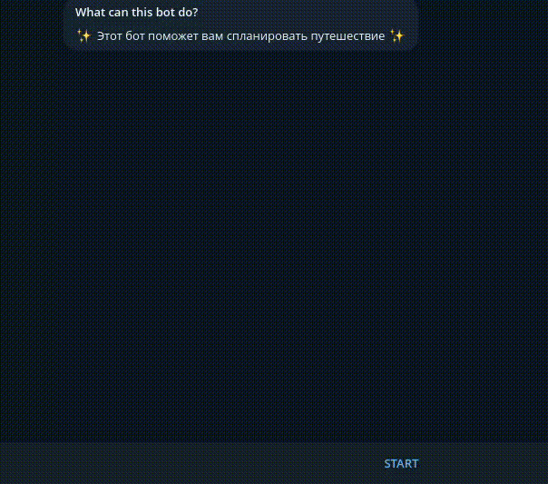
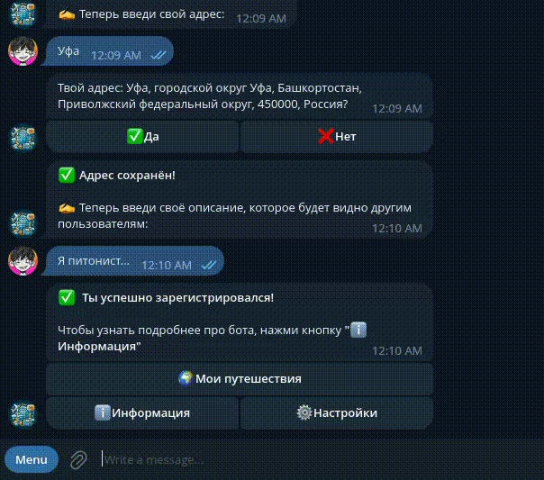
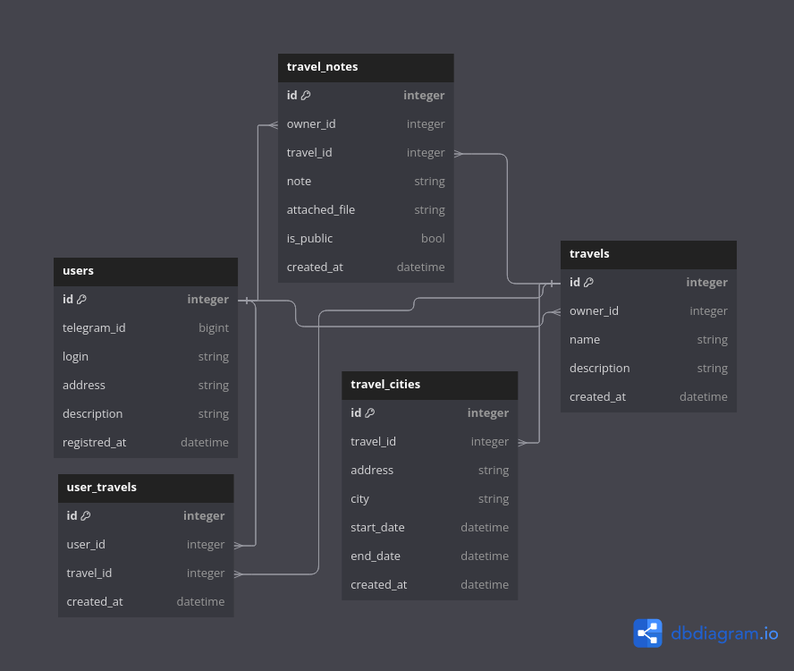
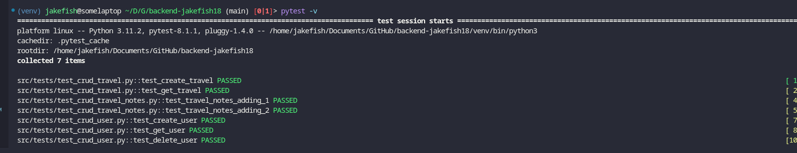

# Backend: Travel agent 3.0 
___
Ссылка на бота: https://t.me/TravelManagmentBot

Это приложение предназначено для удобного планирования и упрощения путешествий. В качестве интерфейса для
пользователя используется telegram-bot, написанный на python, aiogram3. 

В текущее время бот поддерживает функции:
1. Регистрация пользователя
2. Редактирование профиля
3. Добавление путешествий
4. Управление пушетествием
5. Добавление заметок к путешествию
6. Управление заметками
7. Добавление друзей в путешествие

## Примеры использования

### Регистрация

### Добавление путешествия

### Добавление заметки

### Добавление пользователя в путешествие

## Сборка и запуск проекта
Чтобы бот заработал, надо склонировать репозиторий

```shell
git clone https://github.com/Central-University-IT-prod/backend-jakefish18.git
cd backend-jakefish18
```

Заменить токен бота и путь для хранения файлов в **_docker-compose.yml_**
```dockerfile
BOT_TOKEN: YOUR_BOT_TOKEN
STORAGE_PATH: STORAGE_PATH
```

И запустить приложение, используя _**docker-compose**_
```shell
docker compose up -d
```

В docker-compose.yml поднимаются следующие контейнеры:
1. _**postgres_prod**_ - docker-контейнер postgresql базы
2. _**migrations**_ - alembic миграции проекта, которые содержатся в ```/src/migrations```
3. _**telegram_bot**_ - telegram-bot, для которого нужно укзаать BOT_TOKEN. В его параметрах передаётся ссылка для подключения к базе

## Использованные технологии
Был сделан акцент на лёгкие и быстрые для использования инструменты:
1. _**Python3.12.1**_ - язык программирования
2. _**PostgreSQL**_ - система управления базой данных
3. _**AiogramV3**_ - библиотека для написания telegram-ботов
4. _**SQLAlchemy2**_ - orm-библиотека для базы данных
5. _**Alembic**_ - библиотека для миграций
6. _**Docker**_ - инструмент для контейниризации
7. _**OpenStreetMapAPI**_ - инструмент для работы с адресами и географией

Решено было воздержаться от использования S3-хранилищ, так как интерфейсом для пользования является 
telegram-bot, что уберёт преимущество быстрой загрузки от S3. Поэтому файлы хранятся просто в директории, которую указал пользователь в ```docker-compose.yml```.

## Схема базы данных
[Ссылка на dbdiagram](https://dbdiagram.io/d/6600119cae072629cecfe34a)


## Структура проекта
Проект содержит следующие подмодули в ```/src```:

### models
Этот модуль предназначен для хранения SQLAlchemy-моделей сущностей БД.

В модуле в качестве названия файла используется имя сущности БД. В самих файлах хранятся SQLAlchemy модельки

### telegram_bot
Модуль telegram-бота, здесь находятся все нужные обработчики и бизнес-логика. 
Все обработчики собираются в ```launch.py```. В ```init.py``` находятся все нужные переменные для работы с ботом.

```middlewares``` - мидлвари для бота, пока что в нём находится только миддлварь для создания SQLAlchemy сессии для БД.

```keyboard_markups``` - модуль для создания и хранения клавиатур telegram-бота.

```client_commands``` - модуль с клиентскими командами в telegram-боте. Команды раскиданы по файлам в хаотчином порядке, нужен рефакторинг и группирование в более общие роутеры.

```message_markdowns``` - модуль, где хранятся некоторые ответы бота в файлах ```.html```. Большинство ответов хранятся напрямую в переменных в ```client_commands```, так как в них не содержится выделение текста: жирность, курсив, ссылки и т.п.

### crud

Create, Read, Update, Delete запросы для каждой сущности из models. ```base.py``` содержит базовый класс, в котором описываются
базовые запросы для каждой сущности. Дальше все сущности наследуются в своих файлах от ```CrudBase``` и дополняют функционал.
К примеру, ```CrudUser``` добавляет возможность получения пользователя по ```telegram_id```, который является уникальным для таблицы ```users```.

### database 

Модуль не выделяется чем-то особенным, тут просто создаются базовые переменные для взаимодействия с БД.

### core

Модуль для какого-то базового и важного функционала, который зависит от проекта, в этом случае тут просто конфиги.

### geography

Модуль для работы с географией. Пока он маленький: содержится только функционал для стандартизации адреса по пользовательскому вводу.

### tests

Модуль с тестами не ```pytest```. Чтобы запустить тесты, надо поставить флаг тестов в настрйоках, очистить юазы и ввести 
```shell
pytest -v
```

## Контакты

Telegram: https://t.me/JakeFish